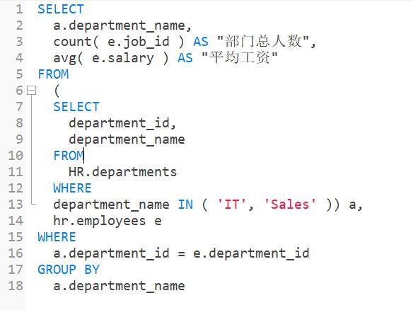

# 实验1：SQL语句的执行计划分析与优化指导 #

----------

## 实验目的 ##

分析SQL执行计划，执行SQL语句的优化指导。理解分析SQL语句的执行计划的重要作用。

## 实验内容 ##

1. 对Oracle12c中的HR人力资源管理系统中的表进行查询与分析。
2. 首先运行和分析教材中的样例：本训练任务目的是查询两个部门('IT'和'Sales')的部门总人数和平均工资，以下两个查询的结果是一样的。但效率不相同。
3. 设计自己的查询语句，并作相应的分析，查询语句不能太简单。

## 样例查询语句 ##

1. set autotrace on SELECT d.department_name,count(e.job_id)as "部门总人数", avg(e.salary)as "平均工资" from hr.departments d,hr.employees e where d.department_id = e.department_id and d.department_name in ('IT','Sales') GROUP BY d.department_name;
2. set autotrace on SELECT d.department_name,count(e.job_id)as "部门总人数", avg(e.salary)as "平均工资" FROM hr.departments d,hr.employees e WHERE d.department_id = e.department_id GROUP BY d.department_name HAVING d.department_name in ('IT','Sales');

## 样例查询语句结果 ##

第一条查询语句结果：

第二条查询语句结果：

## 样例查询语句分析 ##

第一条查询语句的效率相比于第二条更高，我认为的原因是在where处，第一条语句便指定了查询的部门，即departmentname；而第二条语句在GROUP BY语句，即对查询结果进行初步分划后，还使用了HAVING语句进行更细致的划分。

## 设计的查询语句 ##

SELECT a.department_name,count(e.job_id)AS "部门总人数",avg(e.salary)as "平均工资" FROM (SELECT department_id,department_name FROM HR.departments WHERE department_name in ('IT','Sales')) a,hr.employees e WHERE a.department_id=e.department_id GROUP BY a.department_name

## 设计的查询语句分析 ##

1. 舍弃了第二天样例查询语句的HAVING，将departmentname的划分查询语句添加到了where中。
2. 使用了两个FOR循环、where语句，效率介于两条样例查询语句之间。

## 查询语句、结果截图 ##

查询语句：

查询结果：

## 实验总结 ##

本次实验是第一次对oracle数据库的查询，相比于Mysql数据库，前者跟后者的差距并不大，可能还需要后续更多的实验，我才能更加深刻感受到这两个数据库的不同之处。但在我看来，oracle数据库的查询，相较于Mysql有着更高的效率。
