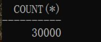

# 实验3：创建分区表 #

----------

## 实验目的 ##
掌握分区表的创建方法，掌握各种分区方式的使用场景。

## 实验内容 ##
1. 本实验使用3个表空间：USERS,USERS02,USERS03。在表空间中创建两张表：订单表(orders)与订单详表(order_details)。
2. 使用你自己的账号创建本实验的表，表创建在上述3个分区，自定义分区策略。
3. 你需要使用system用户给你自己的账号分配上述分区的使用权限。你需要使用system用户给你的用户分配可以查询执行计划的权限。
4. 表创建成功后，插入数据，数据能并平均分布到各个分区。每个表的数据都应该大于1万行，对表进行联合查询。
5. 写出插入数据的语句和查询数据的语句，并分析语句的执行计划。
6. 进行分区与不分区的对比实验。

## 实验步骤 ##
第1步：使用system身份进行登录，并创建账号xianyu_user。

第2步：使用新创建的账号xianyu_user登录，并运行脚本文件test3.sql。

第3步：创建orders表，代码如下：
SQL>CREATE TABLESPACE users02 DATAFILE
  '/home/student/你的目录/pdbtest_users02_1.dbf'
    SIZE 100M AUTOEXTEND ON NEXT 50M MAXSIZE UNLIMITED，
  '/home/student/你的目录/pdbtest_users02_2.dbf' 
    SIZE 100M AUTOEXTEND ON NEXT 50M MAXSIZE UNLIMITED
  EXTENT MANAGEMENT LOCAL SEGMENT SPACE MANAGEMENT AUTO;
  
  SQL>CREATE TABLESPACE users03 DATAFILE
  '/home/student/你的目录/pdbtest_users02_1.dbf'
    SIZE 100M AUTOEXTEND ON NEXT 50M MAXSIZE UNLIMITED，
  '/home/student/你的目录/pdbtest_users02_2.dbf'
    SIZE 100M AUTOEXTEND ON NEXT 50M MAXSIZE UNLIMITED
  EXTENT MANAGEMENT LOCAL SEGMENT SPACE MANAGEMENT AUTO;
  
  SQL> CREATE TABLE orders
  (
   order_id NUMBER(10, 0) NOT NULL
   , customer_name VARCHAR2(40 BYTE) NOT NULL
   , customer_tel VARCHAR2(40 BYTE) NOT NULL
   , order_date DATE NOT NULL
   , employee_id NUMBER(6, 0) NOT NULL
   , discount NUMBER(8, 2) DEFAULT 0
   , trade_receivable NUMBER(8, 2) DEFAULT 0
  )
  TABLESPACE USERS
  PCTFREE 10 INITRANS 1
  STORAGE (   BUFFER_POOL DEFAULT )
  NOCOMPRESS NOPARALLEL
  PARTITION BY RANGE (order_date)
  
   PARTITION PARTITION_BEFORE_2016 VALUES LESS THAN (
   TO_DATE(' 2016-01-01 00:00:00', 'SYYYY-MM-DD HH24:MI:SS',
   'NLS_CALENDAR=GREGORIAN'))
   NOLOGGING
   TABLESPACE USERS
   PCTFREE 10
   INITRANS 1
   STORAGE
  (
   INITIAL 8388608
   NEXT 1048576
   MINEXTENTS 1
   MAXEXTENTS UNLIMITED
   BUFFER_POOL DEFAULT
  )
  NOCOMPRESS NO INMEMORY  
  , PARTITION PARTITION_BEFORE_2017 VALUES LESS THAN (
  TO_DATE(' 2017-01-01 00:00:00', 'SYYYY-MM-DD HH24:MI:SS',
  'NLS_CALENDAR=GREGORIAN'))
  NOLOGGING
  TABLESPACE USERS02
  ...
  );

第4步：创建order_details表，代码如下：
SQL> CREATE TABLE order_details 
 (
 id NUMBER(10, 0) NOT NULL 
 , order_id NUMBER(10, 0) NOT NULL
 , product_id VARCHAR2(40 BYTE) NOT NULL 
 , product_num NUMBER(8, 2) NOT NULL 
 , product_price NUMBER(8, 2) NOT NULL 
 , CONSTRAINT order_details_fk1 FOREIGN KEY  (order_id)
 REFERENCES orders  (  order_id   )
 ENABLE 
 ) 
 TABLESPACE USERS 
 PCTFREE 10 INITRANS 1 
 STORAGE (   BUFFER_POOL DEFAULT ) 
 NOCOMPRESS NOPARALLEL
 PARTITION BY REFERENCE (order_details_fk1)
 (
 PARTITION PARTITION_BEFORE_2016 
 NOLOGGING 
 TABLESPACE USERS --必须指定表空间,否则会将分区存储在用户的默认表空间中
 ...
 ) 
 NOCOMPRESS NO INMEMORY, 
 PARTITION PARTITION_BEFORE_2017 
 NOLOGGING 
 TABLESPACE USERS02
 ...
 ) 
 NOCOMPRESS NO INMEMORY  
 );

第5步：分别查询两个表的数据条数：

第6步：查询2017-1-1至2018-6-1的订单：

第7步：查询2017-1-1至2018-6-1的订单详情：

第8步：查看表空间的数据库文件：

第9步：查看每个文件的磁盘占用情况：

## 实验总结 ##
本次实验学习了如何在虚拟机上中创建分区表，在创建完成后同时进行分区表的相关数据插入。需要注意的是在创建分区表之前应首先分配足够的存储空间，同时还需要运行脚本文件，这就是本次实验的大致收获。