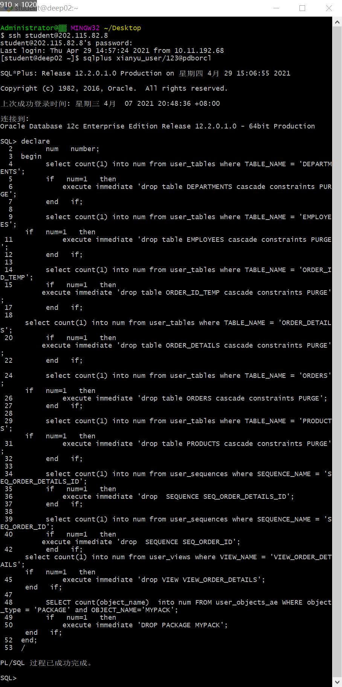

# 实验4：对象管理 #

----------

## 实验目的 ##
了解Oracle表和视图的概念，学习使用SQL语句Create Table创建表，学习Select语句插入，修改，删除以及查询数据，学习使用SQL语句创建视图，学习部分存储过程和触发器的使用。

## 实验场景 ##
假设有一个生产某个产品的单位，单位接受网上订单进行产品的销售。通过实验模拟这个单位的部分信息：员工表，部门表，订单表，订单详单表。

## 实验内容 ##
**一、录入数据**： 要求至少有1万个订单，每个订单至少有4个详单。至少有两个部门，每个部门至少有1个员工，其中只有一个人没有领导，一个领导至少有一个下属，并且它的下属是另一个人的领导（比如A领导B，B领导C）。

**二、序列的应用**：插入ORDERS和ORDER_DETAILS两个表的数据时，主键ORDERS.ORDER_ID, ORDER_DETAILS.ID的值必须通过序列SEQ_ORDER_ID和SEQ_ORDER_ID取得，不能手工输入一个数字。

**三、触发器的应用**：维护ORDER_DETAILS的数据时（insert,delete,update）要同步更新ORDERS表订单应收货款ORDERS.Trade_Receivable的值。

**四、查询数据**：
1.查询某个员工的信息
2.递归查询某个员工及其所有下属，子下属员工。
3.查询订单表，并且包括订单的订单应收货款: Trade_Receivable= sum(订单详单表.ProductNum*订单详单表.ProductPrice)- Discount。
4.查询订单详表，要求显示订单的客户名称和客户电话，产品类型用汉字描述。
5.查询出所有空订单，即没有订单详单的订单。
6.查询部门表，同时显示部门的负责人姓名。
7.查询部门表，统计每个部门的销售总金额。

## 实验步骤 ##
第1步：删除表、序列，同时会删除主外键、触发器、程序包；

第2步：DDL for Table DEPARTMENTS；

第3步：DDL for Table EMPLOYEES；

第4步：DDL for Table ORDER_ID_TEMP；

第5步：DDL for Table ORDERS；

第6步：创建本地分区索引ORDERS_INDEX_DATE：

第7步：这个索引是必须的，可以使整个订单的详单存放在一起：

第8步：创建3个触发器：

第9步：批量插入订单数据之前，禁用触发器：

第10步：DDL for Trigger ORDER_DETAILS_ROW_TRIG：

第11步：DDL for Trigger ORDER_DETAILS_SNTNS_TRIG：

第12步：DDL for Sequence：

第13步：DDL for View VIEW_ORDER_DETAILS：

第14步：插入DEPARTMENTS，EMPLOYEES数据：

第15步：批量插入订单数据，注意ORDERS.TRADE_RECEIVABLE（订单应收款）的自动计算,注意插入数据的速度，2千万条记录，插入的时间是：18100秒（约5小时）：

第16步：最后动态增加一个PARTITION_BEFORE_2018分区：

第17步：一切就绪，开始测试。以下时间在0.02秒以内才正常：（id取值从1到20000000）：

第18步：查询分区表情况：

第19步：查询分区索引情况：

第20步：查询一个分区中的数据：

第21步：分析单个表：

第22步：统计用户的所有表：

第23步：统计完成后，查询表的统计信息：

