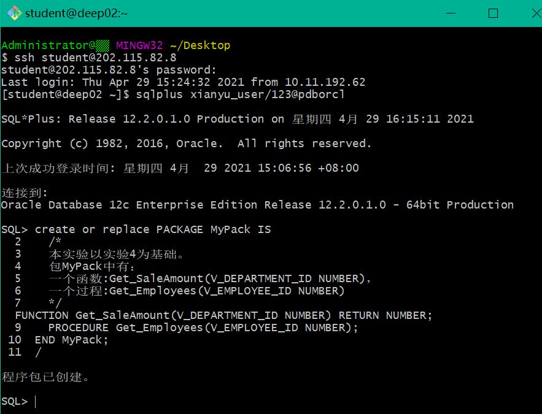
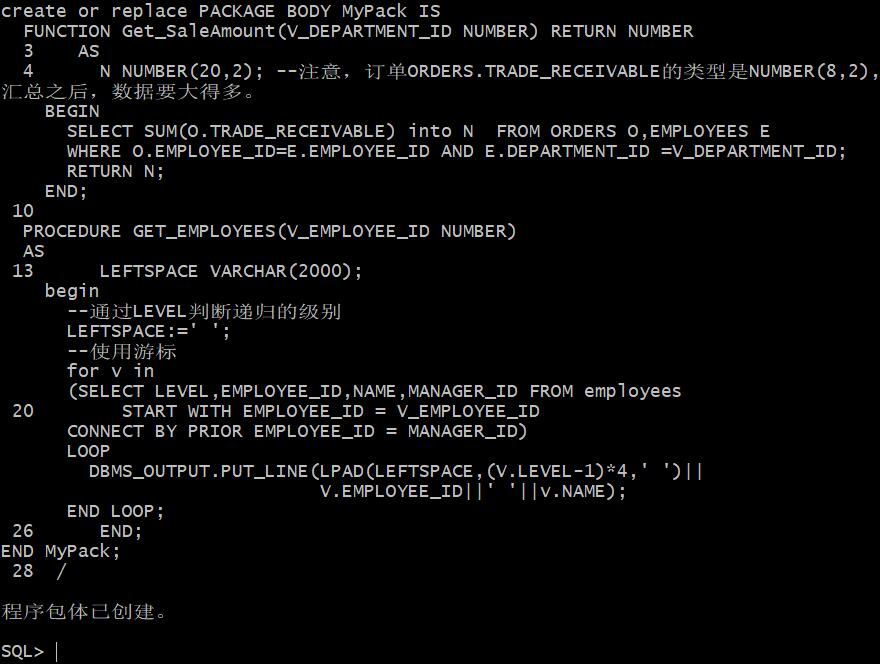
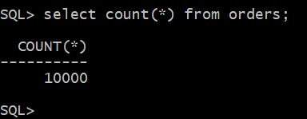
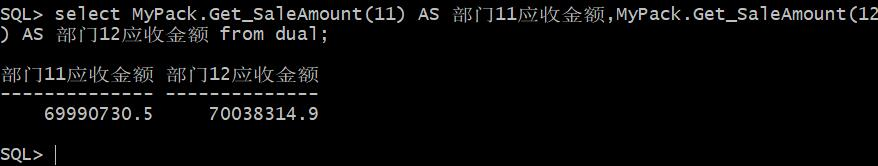
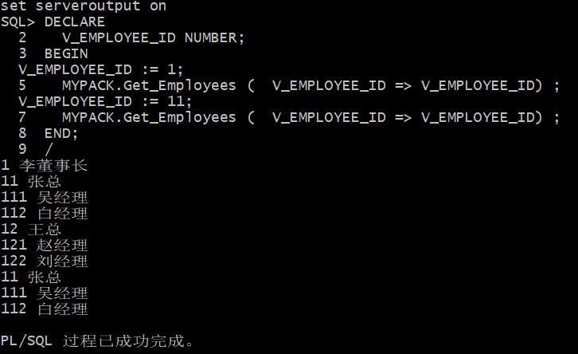

# 实验5：PL/SQL编程 #

----------

## 实验目的 ##
1. 了解PL/SQL语言结构；
2. 了解PL/SQL变量和常量的声明和使用方法；
3. 学习条件语句的使用方法；
4. 学习分支语句的使用方法；
5. 学习循环语句的使用方法；
6. 学习常用的PL/SQL函数；
7. 学习包，过程，函数的用法。

## 实验场景 ##
- 假设有一个生产某个产品的单位，单位接受网上订单进行产品的销售。通过实验模拟这个单位的部分信息：员工表，部门表，订单表，订单详单表；
- 本实验以实验四为基础。

## 实验内容 ##
**一**： 创建一个包(Package)，包名是MyPack。

**二**：在MyPack中创建一个函数SaleAmount ，查询部门表，统计每个部门的销售总金额，每个部门的销售额是由该部门的员工(ORDERS.EMPLOYEE_ID)完成的销售额之和。函数SaleAmount要求输入的参数是部门号，输出部门的销售金额。

**三**：在MyPack中创建一个过程，在过程中使用游标，递归查询某个员工及其所有下属，子下属员工。过程的输入参数是员工号，输出员工的ID,姓名，销售总金额。信息用dbms_output包中的put或者put_line函数。输出的员工信息用左添加空格的多少表示员工的层次（LEVEL）。比如下面显示5个员工的信息。

**四**：由于订单只是按日期分区的，上述统计是全表搜索，因此统计速度会比较慢，如何提高统计的速度呢？

## 实验步骤 ##
第1步：创建一个包：

第2步：在MyPack中创建一个函数SaleAmount和游标：

第3步：查询部门表，统计每个部门的销售总金额：

第4步：函数Get_SaleAmount()测试方法：

第5步：过程Get_Employees()测试代码：

#  #如何提高统计的速度？ 答：使用分区查询、使用索引。
