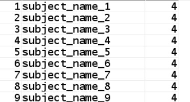
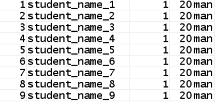
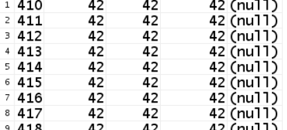
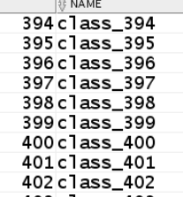
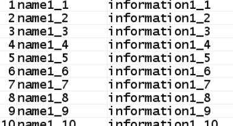

# 期末实验：成都大学班级管理系统 #

----------

## 项目要求 ##
1. 自行设计一个信息系统的数据库项目，自拟某项目名称。；
2. 设计项目涉及的表及表空间使用方案。至少5张表和5万条数据，两个表空间；
3. 设计权限及用户分配方案。至少两类角色，两个用户；
4. 在数据库中建立一个程序包，在包中用PL/SQL语言设计一些存储过程和函数，实现比较复杂的业务逻辑，用模拟数据进行执行计划分析；

## 实验简介 ##
自从新世纪以来，人群的学历素养也在不断提高，随之而来的便是各所学校人数的增加。因此对于一所学校而言，教务系统的地位是首位的，学生的个人信息内容繁杂，资料众多，人工管理难度可想而知，伴随之效率也是极低的。本系统针能够尽可能的提高学生信息管理的效率，同时这也是科学化、正规化的管理模式，这也预示着科学技术的发展会带来全新的管理模式。今年来计算机硬件设随着这些年电脑计算机的速度质的提高，成本的下降等各种因素，都使得IT互联网逐渐向大众的趋势靠拢。

## 实验内容 ##
**一、创建表及其表空间**

1、创建表空间

    create tablespace 表间名 datafile '文件名' size 表空间大小
    create tablespace data_test datafile 'e:\oracle\oradata\test\data_1.dbf' size 2000M;
    create tablespace idx_test datafile 'e:\oracle\oradata\test\idx_1.dbf' size 2000M;

2、在表空间中创建新用户

    create user 用户名 identified by 密码 default tablespace 表空间表;
    create user study identified by study default tablespace data_test;

3、指定表空间

    create user 用户名 identified by 密码 default tablespace 表空间表;
    create user study identified by study default tablespace data_test;

**二、创建用户及角色**

1、创建角色命名为student，创建新用户

    CREATE ROLE student;
	GRANT connect,resource,CREATE VIEW TO student;
	CREATE USER user_lft IDENTIFIED BY 123 DEFAULT TABLESPACE users TEMPORARY TABLESPACE temp;
	ALTER USER user_lft QUOTA 50M ON users;
	GRANT student TO user_lft;
	exit

2、将新用户连接至pdborcl数据库中

3、创建角色命名为teacher，创建新用户

	CREATE ROLE teacher;
	CREATE USER teacher_lft IDENTIFIED BY 123 DEFAULT TABLESPACE users TEMPORARY TABLESPACE temp;
	GRANT teacher TO teacher_lft;
	exit

4、依旧用该新用户创建表格

	 CREATE TABLE "STUDENT_LFT"."CLASS" 
   		("ID" NUMBER, 
	"NAME" VARCHAR2(50 BYTE)
  	 ) SEGMENT CREATION DEFERRED 
  	PCTFREE 10 PCTUSED 40 INITRANS 1 MAXTRANS 255 
	NOCOMPRESS LOGGING
  	TABLESPACE "USERS" ;

 	 CREATE TABLE "STUDENT_LFT"."CURRICULUM" 
  	 (	"ID" NUMBER, 
	"SUBJECT_ID" NUMBER, 
	"CLASS_ID" NUMBER, 
	"TEACHER_ID" NUMBER, 
	"TIME" DATE
  	 ) SEGMENT CREATION DEFERRED 
  	PCTFREE 10 PCTUSED 40 INITRANS 1 MAXTRANS 255 
 	NOCOMPRESS LOGGING
  	TABLESPACE "USERS" ;
  
 	 CREATE TABLE "STUDENT_LFT"."MYCLASS" 
 	  (	"ID" NUMBER, 
		"NAME" VARCHAR2(50 BYTE)
	   ) SEGMENT CREATION DEFERRED 
	  PCTFREE 10 PCTUSED 40 INITRANS 1 MAXTRANS 255 
	 NOCOMPRESS LOGGING
	  TABLESPACE "USERS" ;
	  
	  CREATE TABLE "STUDENT_LFT"."STUDENT" 
	   (	"ID" NUMBER, 
		"NAME" VARCHAR2(50 BYTE), 
		"CLASS_ID" NUMBER, 
		"AGE" NUMBER(*,0), 
		"SEX" VARCHAR2(50 BYTE)
	   ) SEGMENT CREATION DEFERRED 
	  PCTFREE 10 PCTUSED 40 INITRANS 1 MAXTRANS 255 
	 NOCOMPRESS LOGGING
	  TABLESPACE "USERS" ;
	  
	  CREATE TABLE "STUDENT_LFT"."SUBJECT" 
	   (	"ID" NUMBER, 
		"NAME" VARCHAR2(50 BYTE), 
		"CREDIT" NUMBER(*,0)
	   ) SEGMENT CREATION DEFERRED 
	  PCTFREE 10 PCTUSED 40 INITRANS 1 MAXTRANS 255 
	 NOCOMPRESS LOGGING
	  TABLESPACE "USERS" ;
	
	  CREATE TABLE "STUDENT_LFT"."TEACHER" 
	   (	"ID" NUMBER, 
		"NAME" VARCHAR2(50 BYTE), 
		"INFORMATION" VARCHAR2(50 BYTE)
	   ) SEGMENT CREATION DEFERRED 
	  PCTFREE 10 PCTUSED 40 INITRANS 1 MAXTRANS 255 
	 NOCOMPRESS LOGGING
	  TABLESPACE "USERS" ;

5、创建视图，将其保存在数据库中

	CREATE OR REPLACE FORCE EDITIONABLE VIEW "STUDENT_LFT"."MYVIEW_CURRICULUM" ("ID") AS 
	  SELECT id FROM curriculum;
	  
	CREATE OR REPLACE FORCE EDITIONABLE VIEW "STUDENT_LFT"."MYVIEW_MYCLASS" ("ID") AS 
	  SELECT name FROM myclass;
	  
	CREATE OR REPLACE FORCE EDITIONABLE VIEW "STUDENT_LFT"."MYVIEW_STUDENT" ("ID") AS 
	  SELECT name FROM student;
	  
	  CREATE OR REPLACE FORCE EDITIONABLE VIEW "STUDENT_LFT"."MYVIEW_SUBJECT" ("ID") AS 
	  SELECT name FROM subject;
	  
	  CREATE OR REPLACE FORCE EDITIONABLE VIEW "STUDENT_LFT"."MYVIEW_TEACHER" ("ID") AS 
	  SELECT name FROM teacher;

6、将创建表的对象授权给名为teacher的用户

	GRANT SELECT ON myview_MYCLASS TO teacher_lft;
	GRANT SELECT ON myview_SURRICULUM TO teacher_lft;
	GRANT SELECT ON myview_STUDENT TO teacher_lft;
	GRANT SELECT ON myview_SUBJECT TO teacher_lft;
	GRANT SELECT ON myview_TEACHER TO teacher_lft;

**三、向数据库中写入数据**

1、学科表

	DECLARE
	    maxnumber   CONSTANT NUMBER := 100;
	    i           NUMBER := 1;
	BEGIN
	    FOR i IN 1..maxnumber LOOP
	        INSERT INTO subject ( id,name,credit ) VALUES (
	            i,
	            concat('subject_name_',i),
	            4
	        ); --CONCAT('test',i)是将test与i进行拼接
	
	    END LOOP;
	
	    dbms_output.put_line(' 成功录入数据！ ');
	    COMMIT;
	END;

添加结果截图如下：

2、学生表

	DECLARE
	    maxnumber   CONSTANT NUMBER := 50000;
	    i           NUMBER := 1;
	    my_class_id NUMBER := 1;
	BEGIN
	    FOR i IN 1..maxnumber LOOP
	    if mod(i,500)=0 then my_class_id:=my_class_id+1;
	    end if;
	        INSERT INTO student ( id,name,class_id,age,sex ) VALUES (
	            i,
	            concat('student_name_',i),
	            my_class_id,
	            20,
	            'man'
	        ); --CONCAT('test',i)是将test与i进行拼接
	
	    END LOOP;
	
	    dbms_output.put_line(' 成功录入数据！ ');
	    COMMIT;
	END;
添加结果截图如下：

3、课程表
	DECLARE
	    maxnumber   CONSTANT NUMBER := 1000;
	    i           NUMBER := 1;
	    my_subject_id NUMBER := 1;
	    my_class_id NUMBER := 1;
	    my_teacher_id NUMBER := 1;
	BEGIN
	    FOR i IN 1..maxnumber LOOP
	    if mod(i,10)=0 then my_class_id:=my_class_id+1;
	    end if;
	    if mod(i,10)=0 then my_subject_id:=my_subject_id+1;
	    end if;
	    if mod(i,10)=0 then my_teacher_id:=my_teacher_id+1;
	    end if;
	        INSERT INTO curriculum ( id,subject_id,class_id,teacher_id ) VALUES (
	            i,
	            my_subject_id,
	            my_class_id,
	            my_teacher_id
	        ); --CONCAT('test',i)是将test与i进行拼接
	
	    END LOOP;
	    
	    dbms_output.put_line(' 成功录入数据！ ');
	    COMMIT;
	END;
添加结果截图如下：

4、班级表

	DECLARE
	    maxnumber   CONSTANT NUMBER := 100;
	    i           NUMBER := 1;
	BEGIN
	    FOR i IN 1..maxnumber LOOP
	        INSERT INTO myclass ( id,name ) VALUES (
	            i,
	            concat('class_',i)
	        ); --CONCAT('test',i)是将test与i进行拼接
	    END LOOP;
	
	    dbms_output.put_line(' 成功录入数据！ ');
	    COMMIT;
	END;

添加结果截图如下：

5、教师表

	DECLARE
	    maxnumber   CONSTANT NUMBER := 100;
	    i           NUMBER := 1;
	BEGIN
	    FOR i IN 1..maxnumber LOOP
	        INSERT INTO teacher ( id,name,information ) VALUES (
	            i,
	            concat('name1_',i),
	            concat('information1_',i)
	        ); --CONCAT('test',i)是将test与i进行拼接
	
	    END LOOP;
	
	    dbms_output.put_line(' 成功录入数据！ ');
	    COMMIT;
	END;

添加结果截图如下：

**四、查询数据**

1、查询学生的具体分数

	create or replace procedure p_contract_purchase_import(
	 V_IN_SUBCOMPANYID    in VARCHAR2,
	 V_IN_PURCONTRACTMONEY  in NUMBER,                       
	 V_IN_PARTYBNAME     in VARCHAR2, 
	 v_o_ret     out number        )
	
	as
	V_SUPPLIERID      INTEGER; 
	V_PARTYBACCOUNT     VARCHAR2(100);
	V_SQLERRM     VARCHAR2(4000);
	
	begin
	
	 v_o_ret := 1;  
	 V_SUPPLIERID := '';
	 V_PARTYBACCOUNT := '';
	
	 if(V_IN_PARTYBNAME is not null) then
	  begin
	   select t.SUPPLIERID,t.PARTYBACCOUNT,t.PARTYBBANK ,t.PARTYBNAME 
	    into V_SUPPLIERID,V_PARTYBACCOUNT,V_PARTYBBANK,V_PARTYBNAME
	    from T_SUPPLIER t where t.PARTYBNAME=trim(V_IN_PARTYBNAME) and t.SUBCOMPANYID=trim(V_IN_SUBCOMPANYID);
	
	  exception
	   when others then
	    v_o_ret := 4 ; 
	    V_PARTYBNAME := V_IN_PARTYBNAME;
	
	    V_SQLERRM := SQLERRM;
	    INSERT INTO T_LOG_DBERR
	    (ERRTIME, ERRMODEL, ERRDESC)
	    VALUES
	     (SYSDATE,
	      'PROCEDURES',
	      'p_contract_purchase_import:ret=' || v_o_ret ||','||
	    V_SQLERRM);
	    COMMIT;
	  end ;
	 end if;
	
	  end ; 
	  commit;
	  v_o_ret :=0 ;
	 return;
	
	EXCEPTION
	 WHEN OTHERS THEN
	  ROLLBACK;
	  V_SQLERRM := SQLERRM;
	  INSERT INTO T_LOG_DBERR
	   (ERRTIME, ERRMODEL, ERRDESC)
	  VALUES
	   (SYSDATE,
	   'PROCEDURES',
	   'p_contract_purchase_import:ret=' || v_o_ret ||','||
	   V_SQLERRM);
	  COMMIT;

	end p_contract_purchase_import;

2、查询不同班级的具体人数

	create or replace PACKAGE MyPack IS
	
	  PROCEDURE numberOfQueries(my_class_id NUMBER);
	 END MyPack;
	 /
	 create or replace PACKAGE BODY MyPack IS
	   PROCEDURE numberOfQueries(my_class_id NUMBER)
	   AS
	   lft integer; 
	   BEGIN
	     select id into lft
	     from student
	     where class_id=my_class_id;
	   COMMIT;
	   END numberOfQueries;
	 END MyPack;
	
	 set serveroutput on
	 DECLARE
	  my_class_id NUMBER;  
	 BEGIN
	  my_class_id := 1;
	  MYPACK.numberOfQueries (my_class_id) ; 
	 END;

3、查询所有科目的学分

	create or replace PACKAGE MyPack IS
	 
	  FUNCTION Get_AllCredit(V_DEPARTMENT_ID NUMBER) RETURN NUMBER;
	  
	 END MyPack;
	 
	 FUNCTION Get_AllCredit(V_DEPARTMENT_ID NUMBER) RETURN NUMBER
	  AS
	   N NUMBER(20,2);
	   BEGIN
	    SELECT SUM(subject.credit) into N FROM subject;
	    RETURN N;
	   END;
	 END MyPack;

**五、 数据库备份**

Oracle的备份与恢复有三种标准的模式，大致分为两类，备份恢复(物理上的)以及导入导出(逻辑上的)，而备份恢复又可以根据数据库的工作模式分为非归档模式(Nonarchivelog-style) 和归档模式(Archivelog-style),通常，我们把非归档模式称为冷备份，而相应的把归档模式称为热备份。

物理备库：

	physical standby, 备库与主数据库完全一样的备份（数据为物理块到块的复制)，数据库的表和索引都相同，物理结构是相同的。
	基于RMAN实现，传输和直接应用redo log来实现。

逻辑备库：

	logical standby，逻辑备库，standby侧的逻辑信息是一样的，物理信息和数据结构是不同的，其实现原理是将redo log中的信息提取出SQL，接着在standby执行相应的SQL语句。		

**六、热备份和冷备份优缺点**

热备份的优点是：

	1．可在表空间或数据文件级备份，备份时间短。
	
	2．备份时数据库仍可使用。
	
	3．可达到秒级恢复（恢复到某一时间点上）。
	
	4．可对几乎所有数据库实体作恢复。
	
	5．恢复是快速的，在大多数情况下在数据库仍工作时恢复。

热备份的不足是：

	1．不能出错，否则后果严重。
	
	2．若热备份不成功，所得结果不可用于时间点的恢复。
	
	3．因难维护，所以要特别仔细小心，不允许“以失败而告终”。

冷备份的优点是：

	1．是非常快速的备份方法（只需拷贝文件）
	
	2．容易归档（简单拷贝即可）
	
	3．容易恢复到某个时间点上（只需将文件再拷贝回去）
	
	4．能与归档方法相结合，作数据库“最新状态”的恢复。
	
	5．低度维护，高度安全。

冷备份不足是：

	1．单独使用时，只能提供到“某一时间点上”的恢复。

	2．在实施备份的全过程中，数据库必须要作备份而不能作其它工作。也就是说，数据库必须是关闭状态。

	3．若磁盘空间有限，只能拷贝到磁带等其它外部存储设备上，速度会很慢。

**七、开始备份**

1、

	cat rman_level0.sh
	

2、

	./rman_level0.sh

3、 查看备份文件的内容

	rman target /
	RMAN> list backup;

4、修改数据

	sqlplus study/123@pdborcl；
	create table t1 (id number,name varchar2(50));
	insert into t1 values(1,'zhang');
	commit;

5、查看修改情况

	select * from t1; 24

6、删除数据库文件，模拟数据库文件损坏

	rm /home/oracle/app/oracle/oradata/orcl/pdborcl/SAMPLE_SCHEMA_users01.dbf;

6、重启损坏的数据库到mount状态

	通过shutdown immediate无法正常关闭数据库
	只能通过shutdown abort强制关闭。然后将数据库启动到mount状态。

7、恢复数据库

	rman target /;
	[RMAN>] : restore database ;
	recover database;
	alter database open;